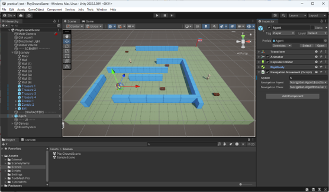

# Desarrollo de Juegos con Inteligencia Artificial - Práctica 1

Este proyecto tiene como objetivo implementar un agente inteligente con algoritmos de búsqueda, para desenvolverse dentro de un mundo virtual utilizando Unity y C#.

## Resumen de la Práctica

El objetivo principal de esta práctica es implementar un agente inteligente y los algoritmos de búsqueda necesarios para que este se desenvuelva dentro de un entorno virtual. Para ello se usará el motor de videojuegos **Unity** y el lenguaje de scripting **C#**. La práctica consistirá en desarrollar las clases que permitan resolver los problemas planteados en el escenario.

## Objetivos

1. **Búsqueda del Camino de Salida (6 puntos)**: Desde cualquier posición en la escena, el agente debe ser capaz de encontrar la meta de manera óptima.
2. **Recogida de Tesoros (2 puntos)**: Desde cualquier posición en la escena, el agente debe ser capaz de recoger los cofres y luego alcanzar la meta, siguiendo el camino óptimo.
3. **Atrapar a los Enemigos (2 puntos)**: Desde cualquier posición en la escena, el agente debe ser capaz de atrapar a los enemigos (zombies), recoger los cofres y luego alcanzar la meta.

## Realización de la Práctica

- **Grupos**: La práctica se realizará en grupos de **3 alumnos**.
- **Fecha de Entrega**: Martes 12 de noviembre de 2024, antes de las 09:00 horas, a través de la tarea que se publicará en el apartado de evaluación del aula virtual.

## Forma de Entrega

1. **Originalidad**:
    - Se pueden utilizar librerías externas para apoyar el programa general, pero la implementación del agente y los algoritmos de búsqueda deben ser creados desde cero.

2. **Documentación**:
    - Se debe presentar un informe donde se describa el contexto del juego, los problemas planteados a la IA, los algoritmos implementados, qué controles tienen los algoritmos y qué valores se les han dado.
    - El código fuente debe estar debidamente comentado.

3. **Funcionalidad**:
    - Los algoritmos deben poder ejecutarse sin errores dentro de un proyecto base.

### Estructura del Proyecto

- El proyecto debe crearse en una subcarpeta de la carpeta `Scripts` denominada `Grupo<letra>` donde `<letra>` es la letra asignada al grupo. Ejemplo: `GrupoA`.
- Dentro de esta carpeta se incluirán:
    - Todas las clases y archivos fuente necesarios para la ejecución del programa.
    - La memoria del proyecto.
    - Todas las clases deben situarse dentro de un **namespace** con el mismo nombre que la carpeta (`namespace GrupoA`).

- El proyecto se exportará en forma de un **package de Unity** denominado `Grupo<letra>.unitypackage`.
- Se deben subir **dos archivos** al aula virtual:
    1. El paquete generado (`GrupoA.unitypackage`).
    2. Un archivo de texto llamado `codigo_fuente.txt` con todo el código fuente.

## Instalación del Entorno Unity

- Crear un proyecto nuevo en **Unity** versión **2022.3.30f1**, de tipo **Universal 3D/3D (URP)**.
- Instalar los siguientes paquetes utilizando el **Package Manager** de Unity:
    - **Probuilder**
    - **CineMachine**
    - **TextMeshPro** (o actualizar a la versión más reciente)

## Carga del unity package

- Sobre el proyecto creado se debe cargar el **unity package** correspondiente a la práctica.

## Entorno de la Práctica

La escena **PlayGroundScene** contiene todos los elementos necesarios:

- **Agent**: El agente inteligente controlado por la IA.
- **Scenery**: El escenario de juego, que incluye:
    - **Floor**: Suelo o tablero de juego.
    - **Wall**: Obstáculos o muros.
    - **Treasure**: Cofres de tesoros estáticos.
    - **Zombie**: Enemigos con movimiento aleatorio.
    - **Exit**: La meta del juego.

## Implementación del Código

- El código de gestión del espacio de estados (el mundo) se entrega como parte del proyecto.
- Deben implementarse las siguientes **interfaces**:
    - **INavigationAgent**: Define al agente inteligente, el cual seleccionará objetivos y usará el algoritmo de navegación para encontrar caminos óptimos.
    - **INavigationAlgorithm**: Define el algoritmo de navegación que debe calcular la ruta óptima entre dos puntos del espacio de estados.

## Algoritmo de Búsqueda

- Debe programarse alguno de los **algoritmos de búsqueda** estudiados en el bloque 1 de la asignatura.
- En la memoria, debe justificarse el uso del algoritmo elegido.

## Licencia MIT

Este proyecto se distribuye bajo la licencia MIT.

--- 
MIT License

Copyright (c) 2023 David María Arribas

Permission is hereby granted, free of charge, to any person obtaining a copy
of this software and associated documentation files (the "Software"), to deal
in the Software without restriction, including without limitation the rights
to use, copy, modify, merge, publish, distribute, sublicense, and/or sell
copies of the Software, and to permit persons to whom the Software is
furnished to do so, subject to the following conditions:

The above copyright notice and this permission notice shall be included in all
copies or substantial portions of the Software.

THE SOFTWARE IS PROVIDED "AS IS", WITHOUT WARRANTY OF ANY KIND, EXPRESS OR
IMPLIED, INCLUDING BUT NOT LIMITED TO THE WARRANTIES OF MERCHANTABILITY,
FITNESS FOR A PARTICULAR PURPOSE AND NONINFRINGEMENT. IN NO EVENT SHALL THE
AUTHORS OR COPYRIGHT HOLDERS BE LIABLE FOR ANY CLAIM, DAMAGES OR OTHER
LIABILITY, WHETHER IN AN ACTION OF CONTRACT, TORT OR OTHERWISE, ARISING FROM,
OUT OF OR IN CONNECTION WITH THE SOFTWARE OR THE USE OR OTHER DEALINGS IN THE
SOFTWARE.
--- 